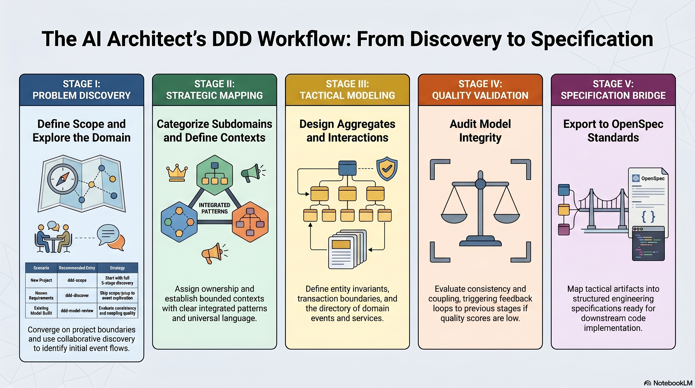
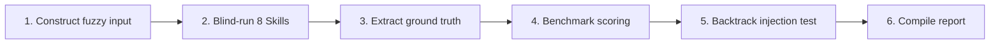

# A Verifiable DDD Modeling Skill Pipeline: From Fuzzy Requirements to Aggregate Models via Engineering Practices

> 🌐 中文版本: [Chinese](ddd-pipeline-article.md)

---

> Note: This article describes the **first version of the pipeline design (4 stages / 8 skills)**, which is also the version that the current Cargo Shipping validation case directly corresponds to.
> The current backbone has been expanded to **5 stages / 9 skills**, with the new Stage V `ddd-openspec-bridge` for converting tactical models to OpenSpec engineering specifications; see [ddd-skill-system-design.en.md](ddd-skill-system-design.en.md) for details.

This system consists of 8 AI Agent Skills forming a 4-stage pipeline (Discovery -> Strategic -> Tactical -> Validation), with the SKILL.md 7-section contract fixing input/output types, 10 quantified backtrack triggers enabling non-linear feedback, and a 6-step blind-run method providing external scoring baselines. Cargo Shipping initial validation: weighted score 85.8%, backtrack triggers 3/3 passed.

---

## Introduction

Domain-Driven Design was proposed over twenty years ago, yet its implementation has always relied on the experiential intuition of a few senior modelers. Eric Evans laid the strategic and tactical dual-layer framework in 2003, Alberto Brandolini brought collaborative modeling into workshops with Event Storming, and Vaughn Vernon's implementation guide gave Aggregates and Bounded Contexts operational guidance — but the predicament of "one person can't carry away a workshop" has never truly been solved. When the modeler leaves, the model stops evolving.

This article uses an open-source experiment — the "DDD Skill Aggregation Repository" — as a sample to demonstrate how to decompose domain modeling into 8 clearly bounded, serializable, backtrackable, and real-case-scorable AI Agent Skills. The Cargo Shipping validation case achieved a weighted score of 85.8% with backtrack triggers 3/3 passing, pushing the old question of "can modeling be engineered" back onto a measurable working surface.

If you're hesitating about "whether to let AI assist your team with DDD," this article offers not a promise, but a set of numbers and a reproducible validation method.

---

## I. Background: The Mutual Attraction of DDD and AI Agents

"Domain-Driven Design" and "AI Agent Skills" matured in different eras but produced a chemical reaction at the intersection window of 2024-2026. On one side is the stable state of methodology — theory is no longer contested, yet practice still heavily depends on individuals; on the other is the engineering paradigm of the Skill form — packaging atomic capabilities as composable, callable units. The collision of these two forces produces a core demand: **turning the implicit modeling thought path into an explicit Skill contract.**

### 1.1 The Stable State of DDD Methodology

DDD's knowledge structure is already quite stable. At the strategic level, Bounded Context and Ubiquitous Language form the macro skeleton, with Context Map defining the collaboration topology between contexts; at the tactical level, Aggregate, Entity, Value Object, and Domain Event are the micro building blocks. From Evans' Blue Book to Vernon's Red Book, from ddd-crew's Starter Modelling Process to the community's Event Storming practices, the semantics of core patterns are highly solidified.

However, the solidification of methodology has not brought consistency in delivery. Event Storming outputs stay on sticky notes, aggregate design decisions exist in architects' minds, and Ubiquitous Language enters a Wiki never to be maintained again. **The methodology is frequently invoked verbally but can hardly be deposited into repeatable, machine-parseable artifacts.**

### 1.2 The Engineering Paradigm of AI Agent Skills

The AI Agent Skill form provides an entirely new hosting medium. A Skill = a YAML-metadata-annotated Markdown prompt + explicit Input/Output/Process/Checklist. It's not a black-box model but a structured "cognitive contract" — telling the Agent under what conditions to start, what steps to follow, what format to output in, and when to determine it's done or needs to backtrack.

The `@skill-name` invocation pattern naturally fits DDD modeling: the same business problem requires multiple rounds of specialized reasoning — first discover domain boundaries, then partition contexts, then design aggregate internal structure — this is exactly a task completed by multiple Skills in relay.

### 1.3 The Intersection Point

The intersection of methodology and Skill form raises a core demand: **Have senior modelers' implicit thought paths deposited as explicit Skill contracts, enabling moderately experienced engineers (or AI Agents) to produce domain models scoring 80+ points.**

This isn't about replacing experts but about encoding expert decision frameworks into repeatable steps, so teams no longer can't build models because "that person isn't here."

---

## II. Problem: Why the Existing DDD Skill Ecosystem Remains "Untrustworthy"

The intersection demand is enticing enough, but three structural shortcomings in the existing ecosystem — fragmentation, lack of contracts, and lack of validation — keep "AI-assisted DDD modeling" stuck at the demo stage. Any technical leader who has seriously evaluated this will ask: **Why should I trust the output of these Skills?**

### 2.1 Fragmentation: 20+ External Skills Each Going Their Own Way

The open-source community has already spawned numerous DDD-related Skills. antigravity-awesome-skills provides `ddd-strategic-design` and `ddd-context-mapping`; claude-skill-registry has `ddd-planning`; wondelai-skills has general-purpose `domain-driven-design`; cleanddd-skills offers a four-stage workflow for the .NET platform; aiee-team focuses on Python ecosystem's `arch-ddd`.

The problem isn't "too few" but "too fragmented." These Skills each define their own naming conventions, stage divisions, and deliverable formats. Some only do strategy, some jump directly to code generation, some mix event storming and aggregate design into a single step. The result is **stage coverage has gaps, concept duplication has redundancy, and it's hard to assemble into an end-to-end pipeline.** Repository A's "event storming" output cannot be directly passed to Repository B's "aggregate design" — they don't speak the same language.

### 2.2 Lack of Contracts: Skill Output Drifts Randomly

The absence of unified interface constraints means the same Skill gives different granularity, fields, and hierarchy across sessions. First run, it gives you a 6-column table; second run, it becomes 3 paragraphs of prose. This is disastrous for downstream consumers — whether human or Agent.

**The next Skill cannot predict what the previous Skill will give it.** If `ddd-aggregates` doesn't know that `ddd-contexts` will output a fixed-format "context directory" table, it must re-guess the input structure every execution. This uncertainty amplifies at each level in a multi-step pipeline, ultimately making the entire chain unreliable.

### 2.3 Lack of Validation: No Ground Truth, No Scoring, No Backtracking

There are virtually no published cases of "blind-running a DDD Skill on a classic sample and scoring it." All improvements are intuition-based: "This Skill's output feels off, let me adjust the prompt" — no baseline, no measurement, no evidence.

Without scoring there's no feedback loop. **Skills cannot iterate along evidence; all changes rely on feel.** Worse still, when the modeling process hits problems, no mechanism tells you "which step to go back and fix." The entire chain is one-way and irreversible — this fundamentally contradicts the real domain modeling process (non-linear, requiring repeated correction).

---

## III. Solution: The Trinity of 8 Skills x 4 Stages x Validation Method

Addressing the three shortcomings above, the DDD Skill Aggregation Repository proposes a trinitarian answer: **4-stage pipeline gives fragments a skeleton, SKILL.md contract gives outputs a contract, blind-run validation method gives iteration evidence.** This section unfolds layer by layer following the process narrative of "skeleton -> contract -> feedback -> validation -> empirical evidence."

For detailed design of stage closures and skill mapping, see the independent design document: [ddd-skill-system-design.en.md](ddd-skill-system-design.en.md).

### 3.1 Skeleton: Four-Stage Linear Main Path

The root cause of fragmentation is lacking a recognized main path. The system backbone adopts 4 stages, representing 4 different types of modeling work — from divergent exploration to precise design to critical review:

| Stage         | Skills                                              | Cognitive Mode           | Key Output Terms                                                 |
| ------------- | --------------------------------------------------- | ------------------------ | ---------------------------------------------------------------- |
| I Discovery   | `ddd-scope`, `ddd-discover`                         | Divergent exploration    | Modeling scope, core processes, event prototypes                 |
| II Strategic  | `ddd-subdomains`, `ddd-contexts`, `ddd-context-map` | Analytical decomposition | Subdomain hierarchy, Bounded Contexts, integration relationships |
| III Tactical  | `ddd-aggregates`, `ddd-domain-interactions`         | Precise design           | Aggregates, domain events, repository/factory interfaces         |
| IV Validation | `ddd-model-review`                                  | Critical review          | Quality scores, backtrack trigger signals                        |

8 Skills cover the complete cognitive chain from "what problem are we solving" to "is the model consistent, complete, and implementable." Each Skill produces structured artifacts in a single conversation turn, with artifacts flowing directly into the next Skill's input — like standard parts on an assembly line.

Key insight: The main path is not a "waterfall." It provides a recommended execution sequence, but the system simultaneously supports 5 non-sequential entry points — existing requirements can enter from `ddd-discover`, known subdomains can go directly to `ddd-contexts`, existing models can use `ddd-model-review` for a health check. The skeleton is not a cage but a highway's main artery.

### 3.2 Contract: SKILL.md Interface Specification

Connecting each Skill on the main path with the same interface contract is what makes them truly interoperable. The contract mandates a 7-section structure, with each section having a clear responsibility definition:

1. **YAML Frontmatter** — name, description, risk, source, tags, date_added, enabling machine discovery and indexing.
2. **When to Use** — when to invoke, what the preconditions are, avoiding mistriggers.
3. **Input Requirements** — what upstream must provide (annotating source Skill), what's optional.
4. **Process** — 5-7 execution steps, Agent operates sequentially.
5. **Output** — tabulated deliverables, fixed column fields, directly consumable by downstream.
6. **Validation Checklist** — this Skill's exit gate, all items must pass before delivery.
7. **Backtrack Triggers** — specific conditions and thresholds triggering return to upstream Skills.

This contract solves the "output drift" problem. Taking `ddd-aggregates` as an example, its output is fixed as 6 tables: aggregate directory, invariant table, entity & value object list, transaction boundary description, cross-aggregate consistency strategy, and repository interface draft. Each table's column names, meanings, and structure requirements are written in the contract. **Inputs and outputs are both typed** — only then can Agents talk about assembly, like functions passing strongly-typed parameters rather than random strings.

### 3.3 Feedback: Non-Linear Backtrack Triggers

The **Backtrack Triggers** section in the contract isn't decoration but the key mechanism distinguishing this system from linear pipelines. Real modeling is never single-pass: you finish aggregate design only to discover context boundaries were wrong; you complete the event directory only to find terminology conflicts are irreconcilable.

The system defines 10 structured backtrack rules covering the full chain from Stage IV to Stage I. The 5 most critical:

| Trigger Condition                                  | Backtrack Target          | Explanation                                                  |
| -------------------------------------------------- | ------------------------- | ------------------------------------------------------------ |
| Invariant expression rate < 60%                    | `ddd-aggregates`          | Aggregates may be data containers, not behavioral boundaries |
| Terminology conflict rate > 20%                    | `ddd-contexts`            | Ubiquitous Language definitions insufficient                 |
| Event completeness < 70%                           | `ddd-domain-interactions` | Event directory missing critical flows                       |
| Aggregate boundaries contradict context boundaries | `ddd-contexts`            | Contexts need re-partitioning for consistency                |
| Integration patterns inconsistent with context map | `ddd-context-map`         | Tactical layer discovered new integration needs              |

The value of triggers is **converting "experience-based judgment" into "quantitative thresholds."** When `ddd-model-review` calculates that a dimension falls below threshold, it can decide which Skill to backtrack to without consulting a human expert. Meanwhile, to prevent infinite loops, the system stipulates that the same backtrack path can execute at most 3 times — if triggered a 3rd time, it's flagged as "architectural decision requiring human intervention."

This mechanism allows Agents to autonomously choose backtrack depth without a human expert present — it doesn't simply "start over" but precisely locates the problematic layer.

### 3.4 Validation: Six-Step Blind-Run Method

With triggers in place, you still need an external ruler to determine whether the Skill combination truly "passes." Relying solely on each Skill's validation checklist cannot prove the entire chain's effectiveness — you need a ground truth source independent of the system.

The validation method is codified as a six-step closed loop:

**Step 1: Construct fuzzy input.** Starting from the reference implementation, rewrite a 500-800 word business brief — containing only business scenarios, roles, goals, and constraints, stripping all DDD terminology and reference implementation class names. This ensures Skills execute under "genuinely not knowing the answer" conditions.

**Step 2: Blind-run 8 Skills.** Execute strictly in 4-stage order, each step reading only the upstream output specified by the current Skill. Blind-run discipline requires no reference to ground truth files during execution — only after all 8 Skill outputs are complete can the scoring phase begin.

**Step 3: Extract ground truth.** Independently extract four categories of ground truth from the reference implementation's source code, architecture documentation, and test cases: contexts, aggregates, events, and integration mappings. Place in the `reference/` directory. Ground truth and blind outputs are completely isolated.

**Step 4: Benchmark scoring.** Assign 1.0-2.0 weights by Skill influence (totaling 11.0), score on a 0-4 five-point scale. Scoring standards include "Type A anchors" (critical concepts that must be hit) and "Type B adjustments" (positive overreach / anti-patterns), ensuring scores are reviewable and repeatable.

**Step 5: Backtrack injection test.** Deliberately inject controlled defects into blind outputs (e.g., retain only 4/11 invariants (36%), have a read-only aggregate perform business judgment), then re-run `ddd-model-review` to verify whether triggers correctly activate and route to expected targets.

**Step 6: Compile report.** Produce a final report with 8 structured sections: executive summary, validation scope, scoring overview, backtrack test results, key findings, improvement recommendations, artifact directory, and conclusion.

Three key constraints make this method trustworthy: blind-run discipline ensures assessment objectivity; independent ground truth extraction ensures baseline reliability; injection testing ensures feedback loop functionality.

### 3.5 Empirical Evidence: Cargo Shipping Case Anchoring

If the skeleton-contract-feedback-validation quartet stays on paper, it's no different from the "existing ecosystem" it criticizes. You must run a real case and publish the numbers to be convincing.

Using the Cargo Shipping DDD Sample co-maintained by Eric Evans and Citerus as the benchmark, the first complete validation was performed. The Cargo case was chosen because it's the DDD community's recognized "classic reference" — with a mature domain model, open-source code, and clear architecture documentation, providing high-quality ground truth.

**Core results:**

- **Weighted total score 85.8% (B+ Good)** — covering all assessment dimensions across 8 Skills. Strongest stages were Discovery (Stage I) and Domain Interactions (Stage III-b), both achieving 4.0/4 perfect scores; weakest were aggregate design and model review (both 2.5/4), the former mainly due to missing Voyage and Location as internal aggregates and the Specification pattern, the latter failing to identify concept overlap and future domain gaps.

- **Backtrack triggers 3/3 all passed** — 3 controlled defects injected: retaining only 4/11 invariants (36%), having TrackingView perform misdelivery judgment, deleting 4 key derived events (completeness 64%). All three triggers correctly activated with accurate diagnosis and correct routing.

- **3 recyclable improvement points** — foreign reference lifecycle re-examination (Voyage/Location should be promoted to aggregates rather than mere ID references), Specification pattern recognition (`isSatisfiedBy` predicates should be explicitly extracted), intermediate concept ADR (ShippingRequest's lifecycle relationship with the order aggregate must be explicitly stated). All three have been fed back into the SKILL.md files of `ddd-aggregates`, `ddd-model-review`, and `ddd-contexts`.

These numbers pull "can AI Agents replace humans for DDD modeling" from a binary debate onto **a regression-testable, evolvable engineering measurement surface.** 85.8% isn't perfect, but it's trackable — next time running the same case, there's a clear improvement path (adding Voyage/Location aggregate discovery and industry benchmarking dimensions), expected to reach 90-95%.

---

## IV. Trade-offs: What This System Gives Up

85.8% is an imperfect but convincing score. Before discussing how to apply it, three categories of structural costs must be candidly stated — they determine what scenarios the system suits and doesn't suit.

### 4.1 Modeling Boundary: Only Modeling, No Implementation

This is the most fundamental design choice. The system's 8 Skills cover the complete path from fuzzy requirements to domain model — but stop at the model.

**Capabilities given up:**

- No business code generation (no Java/Kotlin/Python/C# class files output)
- No architecture compliance checking (static verification of layering rules and dependency directions is out of scope)
- No testing strategy coverage (unit tests, contract tests, integration test design are the responsibility of dedicated Skills or humans)
- No binding to specific tech stacks

**Benefits gained:**

- Modeling Skills can focus on making the domain model itself clean enough — uncontaminated by implementation details
- Teams on any tech stack can reuse the same modeling output
- Code generation is delegated to more capable downstream tools (e.g., cleanddd-skills' .NET scaffolding, arch-ddd's Python repository patterns)

This means: if you need a one-click "from requirements straight to code" experience, this system is not the complete answer — it only handles the first half. But the first half is precisely the part that was hardest to standardize and most dependent on individual experience.

### 4.2 Validation Cost: One Case ≈ 18 Deliverables

Blind-run validation isn't free. A complete validation case requires producing: 1 fuzzy input, 8 blind-run outputs, 4 ground truths, 2 scoring files (rubric + scorecard), 1 injection report, 1 final report — totaling 17-18 structured documents. The Cargo case's complete artifact tree occupies an independent directory hierarchy.

**What's given up:** Lightweight "spot-check" assessment — you can't run just one or two Skills and claim the system is effective.

**What's gained:** Each new case leaves reusable golden artifacts. Ground truth files can be repeatedly used by subsequent versions, scorecards can track score changes across versions, and injection reports verify feedback loop functionality. **Long-term marginal cost decreases** — the first case is most expensive; subsequently you only need to swap fuzzy inputs and ground truth, with scoring methods and report templates fully reused.

### 4.3 Language and Ecosystem: Chinese-Primary, English Terms Preserved

All system documentation, SKILL.md files, and validation reports are Chinese-primary. DDD pattern names (Aggregate, Bounded Context, Domain Event) and code identifiers are preserved in English for compatibility with international literature.

**What's given up:** Frictionless contribution from the international community — non-Chinese speakers need translation to participate.

**What's gained:** Zero-translation usage barrier for Chinese engineering teams. For the target users — architects and technical leads in Chinese-language environments — this is a pragmatic choice. DDD theoretical materials already have abundant high-quality English sources, but **transforming theory into executable Skill contracts** is most efficient in one's native language.

---

## V. Outlook and Reader Action Paths

The quartet (skeleton-contract-feedback-validation) now has its first set of publishable numbers. The path forward depends on role positioning and specific needs.

### For Those Who Want Quick Experience

Start with `@ddd-scope <one-sentence business problem description>`, run through all 8 `@ddd-*` Skills. The complete set of Skills can be executed in a single session, ultimately producing a comprehensive modeling artifact set including problem statement, subdomain classification, context directory, aggregate design, and domain event directory.

The three most common entry points:

- New project -> Start from `ddd-scope`
- Requirements already clear -> Start from `ddd-discover`
- Existing model needs a health check -> Use `ddd-model-review` directly

### For Those Who Want to Reuse the Validation Method

Follow the 6-step process in `validation-cases/README.en.md`, substituting a different reference sample to replicate. Recommended: choose domains with mature open-source implementations (e-commerce's Broadleaf, library management's ddd-by-examples/library). Key operations:

1. Lock the reference implementation's commit via Git submodule
2. Have the fuzzy business brief written by someone other than the scorer (ensuring no DDD terminology leakage)
3. Strictly enforce blind-run discipline — do not open `reference/` until all 8 Skills have produced output
4. Adapt the existing scoring template (rubric.md) for the new case's anchors

Each new passing case raises the system's credibility by one notch.

### For Those Who Want to Contribute Iterations

The system's core evolution protocol is "empirical evidence -> feedback -> re-validation":

1. **Empirical evidence**: Run blind-run validation on new cases or new Skill versions, obtaining scores and defect lists
2. **Feedback**: Convert defects into specific patches for SKILL.md (new process steps, new checklist items, new backtrack trigger conditions)
3. **Re-validation**: Re-run with the same case, confirming score improvement without regression

The Cargo case has already completed one round of feedback — `ddd-aggregates` added the "foreign reference re-examination" step and Specification pattern recognition, `ddd-model-review` added the industry benchmarking dimension, `ddd-contexts` added the intermediate concept ADR checklist item. The next re-run is expected to score 90-95%.

---

**DDD modeling is not mysticism.** It looks like mysticism because no one was willing to write implicit processes as explicit contracts, nor was anyone willing to pin it down with reproducible case numbers. This system proves one thing: as long as you're willing to pay the initial cost of "writing experience as contracts, measuring quality with numbers," moderately experienced teams can consistently produce verifiable domain models.

85.8% is not the finish line — it's the first trackable baseline.

---

## Appendix A: 8-Skill I/O Schema Quick Reference

| Skill                     | Key Inputs                                                             | Key Outputs                                                                                            |
| :------------------------ | :--------------------------------------------------------------------- | :----------------------------------------------------------------------------------------------------- |
| `ddd-scope`               | Business goals/problem description (unstructured text)                 | Problem statement, goals/non-goals, constraints, terminology seeds, risk inventory                     |
| `ddd-discover`            | Business scenarios + `ddd-scope` output                                | Event flow table, command/event candidates, hotspot annotations, ambiguity list, boundary clues        |
| `ddd-subdomains`          | Event flows + boundary clues (from `ddd-discover`)                     | Capability list, subdomain classification, core domain declaration, ownership recommendations          |
| `ddd-contexts`            | Subdomain classification + event flows + hotspots                      | Context directory, Ubiquitous Language glossary, anti-term list, boundary ADRs                         |
| `ddd-context-map`         | Context directory + cross-boundary hotspots                            | Relationship matrix, contract ownership, translation/ACL decisions, failure modes, versioning strategy |
| `ddd-aggregates`          | Event flows + context directory + glossary                             | Aggregate directory, invariant table, entity/VO list, transaction boundaries, consistency strategy     |
| `ddd-domain-interactions` | Aggregate directory + event candidates + context mapping               | Event directory, domain services, repository interfaces, factory list, subscriber matrix               |
| `ddd-model-review`        | Context directory + aggregate directory + event directory (>= 3 items) | Score summary, issue list, backtrack trigger list, implementation readiness                            |

## Appendix B: Complete Backtrack Trigger Matrix

| Detecting Skill           | Trigger Condition                                                        | Backtrack To | Skill(s) to Re-Execute          |
| :------------------------ | :----------------------------------------------------------------------- | :----------- | :------------------------------ |
| `ddd-model-review`        | Aggregate boundaries contradict context boundaries                       | Stage II     | `ddd-contexts`                  |
| `ddd-model-review`        | Terminology conflict rate > 20%                                          | Stage II     | `ddd-contexts`                  |
| `ddd-model-review`        | Invariant expression rate < 60%                                          | Stage III    | `ddd-aggregates`                |
| `ddd-model-review`        | Integration patterns inconsistent with context map                       | Stage II     | `ddd-context-map`               |
| `ddd-model-review`        | Event completeness < 70%                                                 | Stage III    | `ddd-domain-interactions`       |
| `ddd-domain-interactions` | Events need to carry another aggregate's private data                    | Stage III    | `ddd-aggregates`                |
| `ddd-aggregates`          | Invariants span multiple contexts                                        | Stage II     | `ddd-contexts`                  |
| `ddd-context-map`         | Circular dependencies or single context bears > 3 upstream relationships | Stage II     | `ddd-subdomains`/`ddd-contexts` |
| `ddd-contexts`            | > 5 terms have irreconcilable cross-context conflicts                    | Stage I      | `ddd-discover`                  |
| `ddd-subdomains`          | Cannot distinguish Core from Supporting                                  | Stage I      | `ddd-scope`                     |

> **Infinite loop prevention**: The same backtrack path may be executed at most 3 times. If triggered a 3rd time, escalate to `ddd-scope` for realignment, or flag as "requiring human intervention."

## Appendix C: Cargo Case Scorecard Summary

| Skill                   | Weight | Score | Weighted Score | Top Highlight                                            | Main Gap                                                  |
| :---------------------- | :----: | :---: | :------------: | :------------------------------------------------------- | :-------------------------------------------------------- |
| ddd-scope               |  1.0   |  4.0  |      4.00      | Clear non-goals, 20 terminology seeds, 4 risk categories | —                                                         |
| ddd-discover            |  1.5   |  4.0  |      6.00      | 14-step main path + 3 exception branches                 | —                                                         |
| ddd-subdomains          |  1.0   |  3.0  |      3.00      | Core/Supporting/Generic classification correct           | Billing/Customer future gaps                              |
| ddd-contexts            |  1.5   |  3.5  |      5.25      | 4 BCs + Tracking read-only constraint                    | ShippingRequest over-splitting                            |
| ddd-context-map         |  1.5   |  4.0  |      6.00      | ACL + OHS + Customer-Supplier all correct                | —                                                         |
| ddd-aggregates          |  2.0   |  2.5  |      5.00      | HandlingEvent independent aggregate; Delivery as VO      | Missing Voyage + Location; missing Specification          |
| ddd-domain-interactions |  1.5   |  4.0  |      6.00      | RoutingService/ACL separation; idempotency               | —                                                         |
| ddd-model-review        |  1.0   |  2.5  |      2.50      | 8-dimension scoring; correct backtrack judgment          | Failed to identify concept overlap and future domain gaps |
| **Total**               |  11.0  |   —   |  **37.75/44**  | **85.8%**                                                |                                                           |

## Appendix D: Positioning Comparison with 20+ External Skills

| External Skill         | Ecosystem                  | Coverage Stage     | Relationship with This System                           |
| :--------------------- | :------------------------- | :----------------- | :------------------------------------------------------ |
| `ddd-strategic-design` | antigravity-awesome-skills | I-II               | Can serve as enhanced input for Stage I                 |
| `ddd-context-mapping`  | antigravity-awesome-skills | II                 | Can supplement `ddd-context-map`'s pattern library      |
| `ddd-planning`         | claude-skill-registry      | I                  | Can serve as event storming template supplement         |
| `domain-driven-design` | wondelai-skills            | III + code         | Can connect to tactical output for code implementation  |
| `clean-ddd-hexagonal`  | robust-skills              | III + architecture | Can serve as downstream architecture compliance check   |
| `arch-ddd`             | aiee-team                  | III (Python)       | Can consume aggregate directory to generate Python code |
| `cleanddd-skills`      | cleanddd-skills            | I-III (.NET)       | Complete but .NET-bound; parallel reference             |
| `clean-architecture`   | wondelai-skills            | IV                 | Can reinforce `ddd-model-review` scoring                |

> This system's relationship with external Skills is "backbone + optional enhancement" — the backbone ensures pipeline integrity, while external Skills provide specialized deepening at specific stages.
