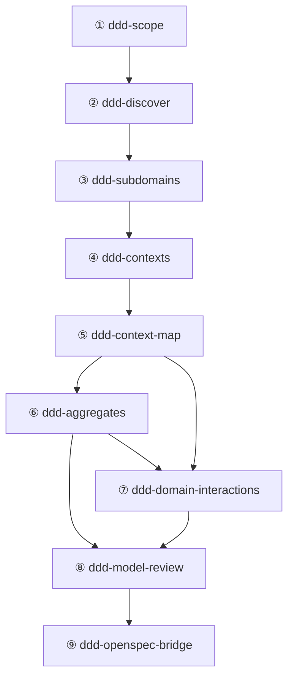

# 领域驱动设计体系主干设计

开源生态提供了大量单点 DDD 能力，但 AI Agent 真正需要的是一套**可重复、可回环的建模链路**：从问题空间发现到战略分解、从战术建模到模型验证，形成闭环。为此，本仓库在 `skills/` 下定义了一组 `ddd-*` 自研 Skill 作为体系主干——每个 Skill 是一段**面向 AI Agent (LLM) 的结构化指令**，在一次对话轮次中执行并产出结构化工件。

**设计边界**：本体系覆盖**领域建模**（战略 + 战术）及**实现规范衔接**（通过 OpenSpec 连接到工程实现），不涉及具体代码实现、测试策略或架构合规性检查。

- `ddd-skills-report.md` — Research report on 20+ DDD skills with evaluation
- `ddd-openspec-mapping.md` — 映射指南：DDD 战术工件向 OpenSpec 规格转化的标准定义

---

## 1. 总体原则与 Skill 接口规范

### 1.1 五阶段模型

体系主干采用 5 个阶段（Stage），代表 **5 种不同类型的建模工作**，而非严格的线性步骤：

| 阶段 | 名称                      | 认知模式 | 关键问题                                 |
| :--- | :------------------------ | :------- | :--------------------------------------- |
| I    | 问题空间发现（Discovery） | 发散探索 | 我们在解决什么问题？领域里发生了什么？   |
| II   | 战略建模（Strategic）     | 分析分解 | 领域如何切分？边界在哪里？语言如何统一？ |
| III  | 战术建模（Tactical）      | 精确设计 | 每个边界内部的构造块是什么？如何协作？   |
| IV   | 模型验证（Validation）    | 批判审查 | 模型是否一致、完整、可实现？             |
| V    | 规范衔接（Specification） | 转换映射 | 如何将领域模型转化为可执行的工程规范？   |

### 1.2 非线性与双向闭环

领域建模是非线性的（参考 R07）。阶段之间存在双向反馈机制：

- **前向推进**：从发现到验证，最后输出为工程规范。
- **后向回溯**：后续阶段发现问题时，基于明确的"触发回溯条件"返回前置阶段修正（见**附录 B**）。
- **非顺序入口**：对于已有系统，可从任意阶段进入（如直接从战术建模开始），只需补充该阶段所需的前置上下文。

### 1.3 Skill 接口规范

每个 `ddd-*` Skill 的 SKILL.md 必须包含以下结构，确保 AI Agent 可解析与执行：

```yaml
---
name: ddd-<skill-name>
description: "<一句话描述>"
risk: safe
source: self
tags: "[ddd, <stage>, <focus>]"
date_added: "<YYYY-MM-DD>"
---
```

正文必须包含以下章节：

| 章节         | 职责       | 说明                               |
| :----------- | :--------- | :--------------------------------- |
| **使用时机** | 触发条件   | 何时应调用此 Skill                 |
| **输入要求** | 前置依赖   | 必需输入与可选输入；标注来源 Skill |
| **流程**     | 执行步骤   | AI Agent 的操作序列（5-7 步）      |
| **输出**     | 交付物规格 | 表格形式：工件名 + 结构要求        |
| **校验清单** | 退出门禁   | 所有条目通过后方可交付             |
| **回溯触发** | 反馈条件   | 触发返回上游 Skill 的具体条件      |
| **示例**     | 调用示范   | `@skill-name` 的典型用法           |

### 1.4 非顺序入口

并非所有使用场景都从阶段 I 开始。系统支持以下入口模式：

| 入口 Skill         | 适用场景                 | 前置条件              |
| :----------------- | :----------------------- | :-------------------- |
| `ddd-scope`        | 全新项目或业务模糊       | 无（入口点）          |
| `ddd-discover`     | 需求已明确，直接探索领域 | 用户提供 scope 上下文 |
| `ddd-contexts`     | 子域已知，需细化边界     | 用户提供子域分类      |
| `ddd-aggregates`   | 单个上下文需深化战术     | 用户提供上下文定义    |
| `ddd-model-review` | 已有模型需质量评估       | 用户提供已有建模工件  |

---

## 2. 阶段与技能映射

### 2.1 技能总览（9 Skills）

#### 阶段 I：问题空间发现

| Skill          | 职责                                      | 核心输出                                        |
| :------------- | :---------------------------------------- | :---------------------------------------------- |
| `ddd-scope`    | 将模糊需求收敛为可执行的建模输入          | 问题陈述、目标/非目标、约束、术语种子、风险清单 |
| `ddd-discover` | 协作式领域发现（事件风暴 / 领域故事讲述） | 事件流表、命令/事件候选、热点标注、歧义清单     |

#### 阶段 II：战略建模

| Skill             | 职责                       | 核心输出                                         |
| :---------------- | :------------------------- | :----------------------------------------------- |
| `ddd-subdomains`  | 识别业务能力并分类子域     | 能力清单、子域分类表、核心域声明、所有权建议     |
| `ddd-contexts`    | 设计限界上下文及其通用语言 | 上下文目录（职责+语言+所有权）、边界 ADR、词汇表 |
| `ddd-context-map` | 映射上下文间关系与集成策略 | 关系矩阵、集成模式、契约所有权、失败模式         |

#### 阶段 III：战术建模

| Skill                     | 职责                     | 核心输出                                                   |
| :------------------------ | :----------------------- | :--------------------------------------------------------- |
| `ddd-aggregates`          | 从不变量出发设计聚合边界 | 聚合目录（根+实体+值对象）、不变量表、事务边界、一致性策略 |
| `ddd-domain-interactions` | 设计构造块间的协作机制   | 领域事件目录、领域服务定义、仓储接口、工厂清单             |

#### 阶段 IV：模型验证

| Skill              | 职责                       | 核心输出                           |
| :----------------- | :------------------------- | :--------------------------------- |
| `ddd-model-review` | 全局模型质量评估与反馈闭环 | 一致性评分、问题清单、回溯触发清单 |

#### 阶段 V：规范衔接

| Skill                 | 职责                                      | 核心输出                                          |
| :-------------------- | :---------------------------------------- | :------------------------------------------------ |
| `ddd-openspec-bridge` | 将 DDD 战术工件映射为 OpenSpec 结构化规范 | OpenSpec 变更集（Proposal, Design, Specs, Tasks） |

### 2.2 依赖关系图



### 2.3 输入/输出流转表

| 源 Skill                    | 产出工件                                    | 被消费方                  |
| :-------------------------- | :------------------------------------------ | :------------------------ |
| ① `ddd-scope`               | 问题陈述、目标/非目标、约束、术语种子、风险 | ② ③ ④ ⑨                   |
| ② `ddd-discover`            | 事件流表、命令/事件候选、热点、歧义清单     | ③ ④ ⑤ ⑥ ⑦ ⑨               |
| ③ `ddd-subdomains`          | 能力清单、子域分类、核心域声明              | ④ ⑤ ⑧ ⑨                   |
| ④ `ddd-contexts`            | 上下文目录、边界 ADR、词汇表                | ⑤ ⑥ ⑦ ⑧ ⑨                 |
| ⑤ `ddd-context-map`         | 关系矩阵、集成模式、契约所有权、失败模式    | ⑥ ⑦ ⑧ ⑨                   |
| ⑥ `ddd-aggregates`          | 聚合目录、不变量表、事务边界                | ⑦ ⑧ ⑨                     |
| ⑦ `ddd-domain-interactions` | 事件目录、服务定义、仓储接口、工厂清单      | ⑧ ⑨                       |
| ⑧ `ddd-model-review`        | 评分、问题清单、回溯触发                    | ①②③④⑤⑥⑦（通过反馈环） ⑨   |
| ⑨ `ddd-openspec-bridge`     | OpenSpec Proposal/Design/Specs/Tasks        | 开发实现 (Implementation) |

### 2.4 可选增强（外部 Skill）

体系主干 Skill 可在每个阶段按需挂接外部 Skill 做能力增强：

| 阶段 | 体系主干                                            | 可选增强（外部）                                                                |
| :--- | :-------------------------------------------------- | :------------------------------------------------------------------------------ |
| I    | `ddd-scope`, `ddd-discover`                         | `ddd-strategic-design`（早期分类）、`ddd-planning`（事件风暴模板）              |
| II   | `ddd-subdomains`, `ddd-contexts`, `ddd-context-map` | `ddd-context-mapping`（集成模式强化）、`domain-driven-design`（战略工件检查）   |
| III  | `ddd-aggregates`, `ddd-domain-interactions`         | `domain-driven-design`（战术建模框架）、`clean-ddd-hexagonal`（依赖规则决策树） |
| IV   | `ddd-model-review`                                  | `clean-architecture`（评分补强）                                                |
| V    | `ddd-openspec-bridge`                               | `openspec-assistant`（规范生成与校验）                                          |

---

## 3. 参考资料与 Skill 映射

为支撑后续对 `skills/ddd-*` 自研体系主干的持续优化，本节将 `ddd-crew/free-ddd-learning-resources` 中的免费学习资料固化为可复用引用清单，并给出每条资料可直接补强的 Skill 与章节位置，确保改动可追溯、可复用、可分批迭代。

### 3.1 引用清单（带元数据）

为了确保理论来源的权威性与全面性，以下清单收集了领域驱动设计领域的经典著作、实践指南与案例研究。这些文献涵盖了战略设计、协作建模与战术落地等多个维度，构成了后续优化体系主干的知识底座。

| ID  | 主题                    | 题名                                                      | 类型          | 作者/组织                            | 年份 | 链接                                                                                                          |
| :-- | :---------------------- | :-------------------------------------------------------- | :------------ | :----------------------------------- | :--- | :------------------------------------------------------------------------------------------------------------ |
| R01 | Fundamentals            | Domain-Driven Design Reference                            | EBook (PDF)   | Eric Evans                           | 2015 | https://domainlanguage.com/wp-content/uploads/2016/05/DDD_Reference_2015-03.pdf                               |
| R02 | Fundamentals            | Domain-Driven Design Quickly                              | EBook         | Abel Avram, Floyd Marinescu          |      | https://www.infoq.com/minibooks/domain-driven-design-quickly/                                                 |
| R03 | Fundamentals            | DDD: The First 15 Years                                   | EBook         | Various Authors                      |      | https://leanpub.com/ddd_first_15_years                                                                        |
| R04 | Fundamentals            | The Anatomy of Domain-Driven Design                       | EBook         | Scott Millett, Samuel Knight         |      | https://leanpub.com/theanatomyofdomain-drivendesign                                                           |
| R05 | Fundamentals            | Domain-Driven Design                                      | Article       | Martin Fowler                        |      | https://martinfowler.com/bliki/DomainDrivenDesign.html                                                        |
| R06 | Fundamentals            | Domain-driven design needn't be hard. Here's how to start | Article       | Thoughtworks (Andrew Hamel-law)      |      | https://www.thoughtworks.com/insights/blog/domain-driven-design-neednt-be-hard-heres-how-start                |
| R07 | Process                 | DDD Starter Modelling Process                             | Repo          | `ddd-crew`                           |      | https://github.com/ddd-crew/ddd-starter-modelling-process                                                     |
| R08 | Fundamentals            | What is DDD?                                              | Video         | Eric Evans                           |      | https://www.youtube.com/watch?v=pMuiVlnGqjk                                                                   |
| R09 | Fundamentals            | Tackling Complexity in the Heart of Software              | Video         | Eric Evans                           |      | https://www.youtube.com/watch?v=dnUFEg68ESM                                                                   |
| R10 | Collaborative Modelling | Event Storming                                            | Practice      | Open Practice Library                |      | https://openpracticelibrary.com/practice/event-storming/                                                      |
| R11 | Collaborative Modelling | Domain Storytelling                                       | Practice      | Open Practice Library                |      | https://openpracticelibrary.com/practice/domain-storytelling/                                                 |
| R12 | Collaborative Modelling | 100,000 Orange Stickies Later                             | Video         | Alberto Brandolini                   |      | https://www.youtube.com/watch?v=fGm62ra_mQ8                                                                   |
| R13 | Collaborative Modelling | Awesome EventStorming                                     | Repo          | Mariusz Gil                          |      | https://github.com/mariuszgil/awesome-eventstorming                                                           |
| R14 | Strategic Design        | Bounded Context                                           | Article       | Martin Fowler                        |      | https://martinfowler.com/bliki/BoundedContext.html                                                            |
| R15 | Strategic Design        | Bounded Contexts                                          | Video         | Cyrille Martraire                    |      | https://www.youtube.com/watch?v=ZEJ2Vyk1HA0                                                                   |
| R16 | Strategic Design        | Practical DDD: Bounded Contexts + Events                  | Video         | Indu Alagarsamy                      |      | https://www.youtube.com/watch?v=Nr6jAwOunGM                                                                   |
| R17 | Strategic Design        | Emergent Boundaries                                       | Article/Video | Matthias Verraes                     | 2017 | https://verraes.net/2017/04/emergent-boundaries/                                                              |
| R18 | Strategic Design        | Socio-technical architecture                              | Video         | Ora Egozi Barzilai, Evelyn van Kelle |      | https://www.youtube.com/watch?v=9Ft39wz6fHM                                                                   |
| R19 | Tactical DDD            | All Our Aggregates Are Wrong                              | Video         | Mauro Servienti                      |      | https://www.youtube.com/watch?v=KkzvQSuYd5I                                                                   |
| R20 | Strategic Design        | Aligning organization and architecture with strategic DDD | Slides        | Michael Plöd                         |      | https://speakerdeck.com/mploed/aligning-organization-and-architecture-with-strategic-ddd                      |
| R21 | Strategic Design        | Strategic Domain-Driven Design Kata: Delivericious        | Case Study    | Nick Tune                            |      | https://medium.com/nick-tune-tech-strategy-blog/strategic-domain-driven-design-kata-delivericious-b114ca77163 |
| R22 | Tactical DDD            | Architecture Patterns with Python                         | EBook         | Harry Percival, Bob Gregory          |      | http://www.cosmicpython.com                                                                                   |
| R23 | Tactical DDD            | Aggregates & Entities in Domain-Driven Design             | Article       | Paul Rayner                          |      | http://thepaulrayner.com/blog/aggregates-and-entities-in-domain-driven-design/                                |
| R24 | Tactical DDD            | Strengthening your domain: a primer                       | Article       | Jimmy Bogard                         | 2010 | https://lostechies.com/jimmybogard/2010/02/04/strengthening-your-domain-a-primer/                             |
| R25 | Tactical DDD            | Domain Modeling Made Functional                           | Video         | Scott Wlaschin                       |      | https://www.youtube.com/watch?v=1pSH8kElmM4                                                                   |
| R26 | Tactical DDD            | Design in the small                                       | Video         | Yves Reynhout                        |      | https://www.youtube.com/watch?v=3iLW4puXHvc                                                                   |
| R27 | Engineering             | Refactoring for DDD Without Microservicing Your Monolith  | Video         | Harry Brumleve                       |      | https://www.youtube.com/watch?v=y2mL-6CcYBw                                                                   |
| R28 | Tactical DDD            | DDD By Examples                                           | Repo          | Jakub Pilimon, Bartłomiej Słota      |      | https://github.com/ddd-by-examples/library                                                                    |
| R29 | Case Study              | 10 Lessons from a Long Running DDD Project (Part 1)       | Article       | Jimmy Bogard                         | 2016 | https://lostechies.com/jimmybogard/2016/06/13/10-lessons-from-a-long-running-ddd-project-part-1/              |
| R30 | Case Study              | OOps I DDD it again and again                             | Slides        | Ora Egozi-Barzilai                   |      | https://www.slideshare.net/OraEgoziBarzilai/mucon-2019-oops-i-ddd-it-again-and-again                          |

### 3.2 引用 → 自研 Skill/章节的改造映射（建议 Backlog）

将外部知识转化为可执行的建模规范是体系演进的关键。下表建立了从理论文献到具体 Skill 改造点的直接映射，根据业务价值与基础缺失程度划分了优先级（P0 至 P2），为后续的技能迭代提供了清晰的执行积压工作（Backlog）。

| 引用 ID | 优先级 | 状态 | 目标 Skill                | 目标章节            | 建议改动点                                                                               |
| :------ | :----- | :--- | :------------------------ | :------------------ | :--------------------------------------------------------------------------------------- |
| R07     | P0     | Done | 全局顶层元规则            | 总体原则            | ~~引入"非线性、可回环"的建模过程原则~~ → 已落地至 §1.2 非线性与双向闭环。                |
| R06     | P1     | Open | `ddd-scope`               | 流程 / 输出         | 引入 Thoughtworks 的渐进式 DDD 启动方法论，强化 scope 收敛中"从哪里开始"的决策框架。     |
| R09     | P2     | Open | `ddd-scope`               | 流程 / 校验清单     | 补充"在复杂性核心做建模"的思维定势提示：避免在非核心域过度投入建模精力。                 |
| R10     | P0     | Open | `ddd-discover`            | 流程 / 输出         | 补齐 Event Storming 标准步骤与参与角色；将异常流、热点标注、歧义处理固化为输出字段。     |
| R12     | P1     | Open | `ddd-discover`            | 回溯触发            | 增补大规模协作建模的典型失败模式：主持节奏、贴纸语义一致性、分歧收敛与会后沉淀。         |
| R11     | P1     | Open | `ddd-discover`            | 流程（备选方法）    | 引入 Domain Storytelling 作为事件风暴的备选发现方法，补充"角色-动作-对象"的叙事结构。    |
| R21     | P1     | Open | `ddd-subdomains`          | 输出 / 示例         | 提供可复用的 Kata 演练方式与输出模板；将练习产物映射到子域分类表与核心域声明。           |
| R18     | P1     | Open | `ddd-subdomains`          | 流程 / 所有权建议   | 引入社会技术架构视角：团队认知负载、Conway 定律对子域划分的影响。                        |
| R14     | P0     | Open | `ddd-contexts`            | 流程 / 校验清单     | 强化 Bounded Context 的语言边界与模型边界；增加"非职责"与"数据所有权冲突"检查项。        |
| R20     | P0     | Open | `ddd-contexts`            | 输出 / ADR          | 引入组织与架构对齐视角：团队边界、Owner、决策权；补齐"边界不随团队演进"的风险提示。      |
| R15     | P1     | Open | `ddd-contexts`            | 流程                | 引入 Cyrille Martraire 的 Bounded Context 生命周期视角：初创、成熟、气泡与自治上下文。   |
| R17     | P1     | Open | `ddd-contexts`            | 回溯触发            | 引入"涌现式边界"思想：边界非一次性决策，需持续观察与调整；细化何时触发边界重划的信号。   |
| R16     | P0     | Open | `ddd-context-map`         | 流程 / 输出         | 引入 Bounded Context + Events 的实践模式：以事件为线索绘制上下文映射，强化契约发现。     |
| R27     | P1     | Open | `ddd-context-map`         | 失败模式 / 翻译决策 | 引入"棕地重构不强拆微服务"的策略：先立 ACL 边界，再渐进拆分；补充遗留系统集成模式。      |
| R23     | P0     | Open | `ddd-aggregates`          | 流程 / 校验清单     | 把聚合划分的核心原则显式化：不变量、事务边界、跨聚合引用；增加"以外键划聚合"的反例检查。 |
| R19     | P0     | Open | `ddd-aggregates`          | 回溯触发            | 增补"聚合普遍划错"的反模式集合与纠偏步骤：拆小一致性边界、事件驱动最终一致、补偿策略。   |
| R24     | P1     | Open | `ddd-aggregates`          | 校验清单            | 强化领域模型的"强度"要求：不变量表达优先；补齐薄弱聚合的判定标准与改进路径。             |
| R26     | P2     | Open | `ddd-aggregates`          | 流程（实体/值对象） | 引入 Yves Reynhout "小尺度设计"思想：值对象优先、实体最小化、聚合根的行为丰富性。        |
| R25     | P1     | Open | `ddd-domain-interactions` | 流程 / 输出         | 引入函数式领域建模视角：用类型系统表达领域事件与状态转换，强化事件契约的精确性。         |
| R22     | P1     | Open | `ddd-domain-interactions` | 仓储接口 / 流程     | 提供领域建模中仓储接口设计的参考范式：聚合加载、持久化契约与查询边界。                   |
| R28     | P1     | Open | `ddd-domain-interactions` | 示例                | 引入 DDD By Examples（Library 案例）的事件驱动设计模式，作为领域交互设计的参考范例。     |
| R29     | P1     | Open | `ddd-model-review`        | 问题清单 / 回溯触发 | 抽取长期项目经验的共性问题：边界漂移、事件泛滥、术语退化；细化触发回溯条件。             |
| R30     | P2     | Open | `ddd-model-review`        | 评分维度            | 引入反复"DDD 做错"的经验教训，补充模型退化的常见信号与预防措施。                         |
| R03     | P2     | Open | `ddd-model-review`        | 校验清单            | 从"DDD 15 年"的多位实践者经验中提取模型质量的长期衡量标准与演进模式。                    |

> **注**：
>
> - R13 (`Awesome EventStorming`) 属于"工具与资源池"分类，不直接作为补强目标，而是作为 `ddd-discover` 的扩展查阅资料库。
> - R01-R05, R08 属于 DDD 基础理论，作为全体 Skill 的知识底座，不映射到特定改造点。

---

## 附录 A：快速启动示例（以"会议室预订系统"为例）

本附录展示体系主干 9 个 Skill 在实际场景中的协作流程片段（本节示例聚焦阶段 I–IV 的建模协作；阶段 V `ddd-openspec-bridge` 的规范输出示例见 [ddd-openspec-mapping.md](ddd-openspec-mapping.md)）。

### A.1 阶段 I：问题空间发现

**`ddd-scope`（①）**

- **输入项**：业务愿景："希望员工能随时预订可用会议室，避免时间冲突"。
- **输出物**：
  - 问题陈述："会议室资源无统一管理，时间冲突频发导致员工效率下降。"
  - 目标：支持按时间段预订、冲突检测、签到确认。
  - 非目标：不涉及会议室设备维修、不涉及视频会议调度。
  - 约束：预订时长为 30 分钟倍数；每人同一时段最多 1 个预订。
  - 术语种子：预订（Booking）、会议室（Room）、时间槽（TimeSlot）、签到（CheckIn）。
- **校验清单**：
  - [x] 目标与非目标互斥且可执行
  - [x] 约束可验证

**`ddd-discover`（②）**

- **输入项**：来自 ① 的 scope 输出。
- **输出物（事件流片段）**：

  | 序号 | 事件             | 触发命令       | 参与者   | 异常路径                       |
  | :--- | :--------------- | :------------- | :------- | :----------------------------- |
  | 1    | RoomRegistered   | RegisterRoom   | Admin    | —                              |
  | 2    | BookingRequested | RequestBooking | Employee | 时段已满 → BookingRejected     |
  | 3    | BookingConfirmed | ConfirmBooking | System   | 冲突检测失败 → BookingRejected |
  | 4    | CheckInRecorded  | RecordCheckIn  | Employee | 超时未签到 → BookingCancelled  |

- **热点标注**：BookingConfirmed 为强一致性点（并发竞争时段）。
- **歧义**："预订"是请求还是已确认？需明确两态区分。

### A.2 阶段 II：战略建模

**`ddd-subdomains`（③）**

| 能力           | 子域类型   | 理由                                     |
| :------------- | :--------- | :--------------------------------------- |
| 预订与冲突管理 | Core       | 核心竞争力：精确的时间冲突检测与并发控制 |
| 会议室资源管理 | Supporting | 必要但非差异化                           |
| 用户身份与权限 | Generic    | 通用能力，可复用已有系统                 |

**`ddd-contexts`（④）**

| 上下文       | 职责                                   | 核心术语                         | 所有权   |
| :----------- | :------------------------------------- | :------------------------------- | :------- |
| Booking      | 预订全生命周期：请求、确认、取消、签到 | Booking, TimeSlot, BookingPolicy | 预订团队 |
| Room Catalog | 会议室注册、容量、设备、可用性         | Room, Capacity, Equipment        | 行政团队 |
| Identity     | 用户认证与授权                         | User, Role, Permission           | 平台团队 |

- **边界 ADR**：Booking 上下文中 Room 仅为 RoomId 引用，不持有 Room 详情；需通过查询获取可用性。
- **词汇表冲突处理**："Room"在 Booking 中为 RoomId（标识），在 Room Catalog 中为完整实体。

**`ddd-context-map`（⑤）**

| 上游         | 下游    | 模式                        | 说明                               |
| :----------- | :------ | :-------------------------- | :--------------------------------- |
| Room Catalog | Booking | OHS (Open Host Service)     | Booking 查询可用会议室列表         |
| Identity     | Booking | ACL (Anti-Corruption Layer) | Booking 翻译 UserId 为 Booker 概念 |

- **失败模式**：Room Catalog 不可用时，Booking 降级为"仅允许已知 RoomId 预订"。

### A.3 阶段 III：战术建模

**`ddd-aggregates`（⑥）**

| 聚合    | 聚合根  | 包含                              | 关键不变量                                           |
| :------ | :------ | :-------------------------------- | :--------------------------------------------------- |
| Booking | Booking | TimeSlot (VO), BookingStatus (VO) | 同一 Room 同一 TimeSlot 不得有两个 Confirmed Booking |
| Room    | Room    | Capacity (VO), Equipment (VO)     | Room 必须有唯一标识与非零容量                        |

- **事务边界**：默认一个事务修改一个聚合。
- **跨聚合一致性**：Booking 确认时需查询 Room 可用性 → 通过领域事件 + 乐观锁实现。

**`ddd-domain-interactions`（⑦）**

| 领域事件         | 源聚合  | 触发条件     | 消费方                   | 幂等键              |
| :--------------- | :------ | :----------- | :----------------------- | :------------------ |
| BookingConfirmed | Booking | 冲突检测通过 | 通知服务（外部）         | BookingId + Version |
| BookingCancelled | Booking | 超时未签到   | Room Catalog（释放时段） | BookingId           |

- **仓储接口**：`BookingRepository.findByRoomAndTimeSlot(roomId, timeSlot)` — 用于冲突检测。
- **领域服务**：`ConflictDetectionService` — 跨 Booking 聚合检查同一时段是否已被占用。

### A.4 阶段 IV：模型验证

**`ddd-model-review`（⑧）**

| 维度       | 评分 | 发现                                                           |
| :--------- | :--- | :------------------------------------------------------------- |
| 术语一致性 | 9/10 | "Room"跨上下文含义已明确区分                                   |
| 聚合边界   | 7/10 | ConflictDetectionService 需跨聚合查询 → 建议评估是否需调整边界 |
| 事件完整性 | 8/10 | 缺少 BookingRejected 事件的正式定义                            |

- **回溯触发**：聚合评分 7/10 → 建议返回 ⑥ `ddd-aggregates`，评估是否将 TimeSlot 可用性提升为独立聚合（RoomSchedule）以消除跨聚合查询。

### A.5 反馈环示例

上述评审触发回溯至 ⑥ `ddd-aggregates`：

- **调整方案**：引入 `RoomSchedule` 聚合，持有某 Room 的全部时段占用状态。
- **新不变量**：RoomSchedule 内同一 TimeSlot 仅允许一个 Confirmed 占用。
- **影响**：ConflictDetectionService 被消除，冲突检测内化为 RoomSchedule 聚合的不变量。
- **重新验证**：聚合评分提升至 9/10，无新回溯触发。

---

## 附录 B：触发回溯条件矩阵

以下矩阵将各 Skill 执行中可能发现的问题固化为可执行的回溯规则，避免经验性判断的不一致：

| 检测 Skill                  | 触发条件                                                | 回溯至   | 需重新执行的 Skill                | 说明                             |
| :-------------------------- | :------------------------------------------------------ | :------- | :-------------------------------- | :------------------------------- |
| ⑧ `ddd-model-review`        | 聚合边界与上下文边界矛盾                                | 阶段 II  | `ddd-contexts`                    | 上下文需重新划分以容纳一致性需求 |
| ⑧ `ddd-model-review`        | 术语冲突率 > 20%                                        | 阶段 II  | `ddd-contexts`                    | 通用语言定义不充分，需重新对齐   |
| ⑧ `ddd-model-review`        | 不变量表达率 < 60%（聚合缺乏显式不变量）                | 阶段 III | `ddd-aggregates`                  | 聚合可能为数据容器而非行为边界   |
| ⑧ `ddd-model-review`        | 集成模式与上下文映射不一致                              | 阶段 II  | `ddd-context-map`                 | 战术层发现了新的集成需求         |
| ⑧ `ddd-model-review`        | 事件完整性 < 70%（事件目录缺失或未覆盖关键流程）        | 阶段 III | `ddd-domain-interactions`         | 事件目录缺失或未覆盖关键流程     |
| ⑦ `ddd-domain-interactions` | 事件需携带另一聚合私有数据（无法设计干净的事件 schema） | 阶段 III | `ddd-aggregates`                  | 聚合边界需调整以保证事件自包含   |
| ⑥ `ddd-aggregates`          | 不变量跨越多个上下文                                    | 阶段 II  | `ddd-contexts`                    | 一致性需求被上下文边界割裂       |
| ⑤ `ddd-context-map`         | 循环依赖或单一上下文承担 > 3 个上游关系                 | 阶段 II  | `ddd-subdomains` / `ddd-contexts` | 可能存在"上帝上下文"或子域误分   |
| ④ `ddd-contexts`            | > 5 个术语存在不可调和的跨上下文冲突                    | 阶段 I   | `ddd-discover`                    | 领域理解不足，需重新发现         |
| ③ `ddd-subdomains`          | 无法区分核心域与支撑域（无差异化能力）                  | 阶段 I   | `ddd-scope`                       | 业务价值主张不清晰               |

> **防止无限循环**：同一回溯路径最多执行 3 次。若第 3 次仍触发，应上升至 `ddd-scope` 重新对齐业务目标，或标记为"需人工介入的架构决策"。
