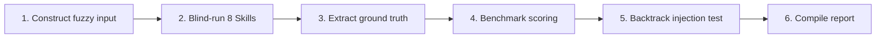

# DDD Skill Validation Method

> 🌐 中文版本: [Chinese](README.md)

---

> This directory documents the **end-to-end validation method** for the 8 in-house DDD modeling skills, along with completed validation cases.
>
> **Validation scope**: The blind-run pipeline covers the 8 Skills of Stages I (Discovery) – IV (Validation); Stage V `ddd-openspec-bridge` (OpenSpec specification bridging) is covered since 2026-08 via the appended `09-ddd-openspec-bridge.out.md` in the [insurance-validation](./insurance-validation/) case.
>
> Current case: [cargo-validation](./cargo-validation/) — using Eric Evans + Citerus' Cargo Shipping DDD Sample as ground truth reference.

## 1. Method Objectives

Perform objective quality assessment of the modeling pipeline composed of the 8 Skills of Stages I–IV under `skills/`, answering three questions:

1. Without DDD terminology hints, can the pipeline converge a vague business description into a usable domain model?
2. How much deviation exists between its output and industry-standard samples, and is the deviation positive or negative?
3. Can `ddd-model-review`'s backtrack trigger mechanism correctly activate the feedback loop when the model degrades?

## 2. Method Principles

| Principle                 | Meaning                                                                                                                                                                                                                         |
| :------------------------ | :------------------------------------------------------------------------------------------------------------------------------------------------------------------------------------------------------------------------------ |
| **Blind Run**             | When executing each Skill, only the upstream input specified by the current Skill may be accessed; reference implementations, ground truth files, or any materials exposing DDD terminology and class names are **prohibited**. |
| **External Ground Truth** | Ground truth is independently extracted to the `reference/` directory, completely isolated from blind outputs; used for scoring only after all blind runs are complete.                                                         |
| **Reviewable**            | Every deduction/bonus must cite specific artifact entries as evidence; scores are repeatable (same input yields same score).                                                                                                    |
| **Backtrack Testing**     | Deliberately inject controlled defects into blind outputs, verifying that `ddd-model-review`'s trigger conditions work as designed and route to the correct backtrack targets.                                                  |
| **Chinese Primary**       | All artifacts and reports are Chinese-primary; code identifiers and DDD pattern names use English.                                                                                                                              |

## 3. Validation Process (6 Steps)



### Step 1 — Construct Fuzzy Input

Starting from the selected reference implementation, rewrite a 500-800 word business brief (`00-fuzzy-prompt.md`) in business language:

- Describe only business scenarios, roles, goals, constraints, and exception cases.
- **Remove** all DDD terminology (aggregates, contexts, entities, VOs, events, etc.).
- **Remove** proprietary class names and design decisions from the reference implementation.
- Retain real-world exception scenarios (e.g., "delays measured in hours to days") to test exception path modeling capability.

### Step 2 — Blind-Run 8-Skill Pipeline

Execute in Stage I–IV pipeline order, each step reading only the current Skill's upstream output:

| Stage           | Seq | Skill                   | Deliverable                                                                |
| :-------------- | :-- | :---------------------- | :------------------------------------------------------------------------- |
| I Discovery     | 01  | ddd-scope               | Problem statement, goals/non-goals, terminology seeds, risks               |
| I Discovery     | 02  | ddd-discover            | Event flow main path, exception branches, commands, hotspots, ambiguities  |
| II Strategic    | 03  | ddd-subdomains          | Capability map, subdomain classification (Core/Supporting/Generic)         |
| II Strategic    | 04  | ddd-contexts            | Context directory, Ubiquitous Language, anti-terms, ADRs                   |
| II Strategic    | 05  | ddd-context-map         | Relationship matrix, contract ownership, ACL, failure modes                |
| III Tactical    | 06  | ddd-aggregates          | Aggregate directory, invariants, entities/VOs, cross-aggregate consistency |
| III Tactical    | 07  | ddd-domain-interactions | Event directory, domain services, factories, subscriber matrix             |
| IV Validation   | 08  | ddd-model-review        | 8-dimension internal review, issue list, backtrack determination           |
| V Specification | 09  | ddd-openspec-bridge     | OpenSpec changeset (proposal / design / specs / tasks)                     |

**Blind-run discipline**: Step 3 may only begin after 08 is complete.

> 09 (Stage V) is a step appended by the [insurance-validation](./insurance-validation/) case; the Cargo case does not run 09.

### Step 3 — Extract Ground Truth

Independently extract the following ground truths from the reference implementation (source code, architecture documentation, feature descriptions) and place in `reference/`:

| Ground Truth File | Extraction Source                                                            |
| :---------------- | :--------------------------------------------------------------------------- |
| `contexts.md`     | Architecture documentation, domain model package structure                   |
| `aggregates.md`   | Aggregate root source code, invariant descriptions, ADRs                     |
| `events.md`       | Test cases (lifecycle scenarios), application-layer event publication points |
| `context-map.md`  | Infrastructure adapters, external interfaces, ACL implementations            |

> If the reference implementation is an open-source project, it is recommended to lock the commit via Git submodule to ensure reproducibility.

### Step 4 — Benchmark Scoring

Produce two artifacts under the `scoring/` directory:

#### 4.1 `rubric.md` (Scoring Standard)

- **Weight table**: Assign 1.0-2.0 weights by Skill influence in the pipeline, totaling 11.0.
- **Scoring criteria**: 0-4 five-point scale (0 = no output; 1 = structural errors; 2 = structure correct but missing key concepts; 3 = hit major concepts; 4 = hit all anchors with no major deviations).
- **Type A anchors**: Critical concepts and design decisions extracted from ground truth that "must be hit" (e.g., HandlingEvent as independent aggregate, Delivery as derived VO).
- **Type B adjustments**: Bonus items (identifying known limitations of the reference implementation, positive overreach); deduction items (anti-patterns, violating Ubiquitous Language rules).

#### 4.2 `scorecard.md` (Scorecard)

One section per Skill, containing:

- A-anchor hit status (hit/partial/miss)
- Deviation table (blind terminology <-> ground truth terminology, judging semantic impact)
- Score and rationale
- Weighted total = Sum(score x weight) / (4 x Sum(weights)) x 100%

> **No-reference cases (expert-review method)**: when the domain has no mature open-source reference implementation, A-class anchors are replaced by four criteria — business completeness (full coverage of the brief), DDD principle compliance, internal consistency (artifact continuity across Skills), and positive overreach recognition (see [insurance-validation/scoring/rubric.md](./insurance-validation/scoring/rubric.md)). Review requirements: **at least 2 reviewers cross-score, or the business side samples ≥ 3 key invariants**, to mitigate subjectivity without ground truth; scores must be marked as "not directly comparable with ground-truth cases".

### Step 5 — Backtrack Injection Test

Inject controlled defects into blind outputs to verify `ddd-model-review`'s backtrack trigger mechanism. Produce `backtrack-test/injection-report.md`.

Recommended injection matrix (corresponding to 5 trigger conditions):

| Trigger Condition                        | Injection Method                                                                           | Expected Backtrack To     |
| :--------------------------------------- | :----------------------------------------------------------------------------------------- | :------------------------ |
| Invariant expression rate < 60%          | Remove most entries from the aggregate invariant table                                     | `ddd-aggregates`          |
| Aggregate-context boundary contradiction | Have a read-only view aggregate take on business judgment responsibility                   | `ddd-contexts`            |
| Event completeness < 70%                 | Remove key derived events from the event directory                                         | `ddd-domain-interactions` |
| Terminology conflict rate > 20%          | Mix different names for the same concept across sections (e.g., Shipment/Cargo/Order)      | `ddd-contexts`            |
| Integration pattern inconsistency        | Declare ACL in context-map but have domain services make bare calls in domain-interactions | `ddd-context-map`         |

Each injection should be executed independently: retain original outputs from `01`-`05` and `08`, only replace `06` or `07` with the flawed version; then "re-run" `08` to see if the expected condition triggers and routes to the expected target.

### Step 6 — Compile Report

Produce `REPORT.md` at the validation case root directory, with mandatory 8 sections:

1. Executive summary (total score, strongest/weakest stage, backtrack test results, number of critical defects)
2. Validation scope (index of input / blind outputs / ground truth / scoring assets)
3. Scoring overview table
4. Backtrack trigger test results
5. Key findings (strengths / weaknesses / positive overreach)
6. Improvement recommendations for the skill system (specific to SKILL.md patch drafts)
7. Artifact directory tree
8. Conclusion

## 4. Directory Structure Convention

A complete validation case directory structure:

```text
validation-cases/<case-name>/
├── 00-fuzzy-prompt.md                     Business brief (blind input)
├── 01-ddd-scope.out.md                    ~ 08 Stage IV (blind outputs)
├── 02-ddd-discover.out.md
├── 03-ddd-subdomains.out.md
├── 04-ddd-contexts.out.md
├── 05-ddd-context-map.out.md
├── 06-ddd-aggregates.out.md
├── 07-ddd-domain-interactions.out.md
├── 08-ddd-model-review.out.md
├── reference/                             Ground truth (written only after blind runs complete)
│   ├── contexts.md
│   ├── aggregates.md
│   ├── events.md
│   └── context-map.md
├── scoring/
│   ├── rubric.md                          Weights, anchors, rules
│   └── scorecard.md                       Per-Skill scores, deviations, total
├── backtrack-test/
│   └── injection-report.md                Injection and trigger verification
└── REPORT.md                              Final summary report
```

## 5. Reusing This Method for New Cases

1. Select a domain with a mature reference implementation (or clear industrial scenario); prefer cases with open-source code.
2. If using an open-source project as ground truth, add it as a Git submodule at `validation-cases/<case-name>-source/`, locking the commit.
3. Rewrite the fuzzy business brief per Step 1; have someone not involved in scoring cross-review it to ensure no DDD terminology leakage.
4. Execute Steps 2-5 strictly; **do NOT** open `reference/` before blind runs are complete.
5. Produce `REPORT.md` with the 8-section structure from Step 6; aggregate all discovered SKILL.md improvement points into the report's "Recommendations" section.
6. If recommendations are adopted and implemented in `skills/<skill>/SKILL.md`, add an "Adopted" link in the REPORT.md conclusion.

## 6. Completed Validation Cases

| Case                                            | Reference Implementation                    | Weighted Score | Report                                                     |
| :---------------------------------------------- | :------------------------------------------ | :------------- | :--------------------------------------------------------- |
| [cargo-validation](./cargo-validation/)         | Cargo Shipping DDD Sample (Evans + Citerus) | **85.8%**      | [REPORT.md](./cargo-validation/REPORT.md) (in Chinese)     |
| [insurance-validation](./insurance-validation/) | None (expert-review method, four criteria)  | **90.9%**\*    | [REPORT.md](./insurance-validation/REPORT.md) (in Chinese) |

> \* insurance-validation is a no-reference case scored with the expert-review method (see its `scoring/rubric.md`); **not directly comparable** with cargo-validation's ground-truth score.

## 7. Known Limitations of the Method

- **Dependent on reference quality**: Ground truth comes from the reference implementation; if the reference itself has controversial modeling decisions (e.g., the Cargo sample's HandlingEvent/Activity/Status semantic overlap), the scoring standard needs explicit exemptions.
- **Blind-run is hard to audit**: Executors may subconsciously use known reference structures. Mitigation: multi-person cross blind-runs, or have different people execute 02 and 06 separately.
- **Limited injection surface**: Each injection tests only one trigger condition; compound defects across conditions are not covered.
- **Subjectivity of the expert-review method**: No-reference cases ([insurance-validation](./insurance-validation/)) use expert review, whose business-completeness criterion cannot be externally verified; mitigation: at least 2 reviewers cross-score, or the business side samples ≥ 3 key invariants (see §4.2).
