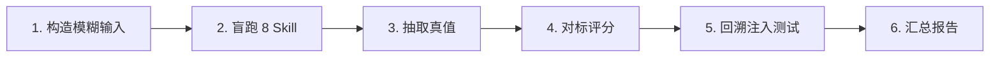

# DDD 技能验证方法 (Validation Method)

> 🌐 English version: [English](README.en.md)

---

> 本目录记录对自研 8 个 DDD 建模 Skill 的 **端到端验证方法**，以及各个已完成的验证案例。
>
> 当前案例：[cargo-validation](./cargo-validation/) — 以 Eric Evans + Citerus 的 Cargo Shipping DDD Sample 为真值参照。

## 1. 方法目标

对 `skills/` 下 8 个 Skill 组成的 4 阶段建模流水线做客观的质量评估，回答三个问题：

1. 在没有 DDD 术语提示的前提下，流水线能否把一段模糊业务描述收敛为一个可用的领域模型？
2. 其产出与行业规范样例之间的偏离程度有多大，偏离是正向还是负向？
3. `ddd-model-review` 的回溯触发机制能否在模型劣化时正确激活反馈闭环？

## 2. 方法原则

| 原则              | 含义                                                                                                                   |
| :---------------- | :--------------------------------------------------------------------------------------------------------------------- |
| **盲跑（Blind）** | 执行每个 Skill 时，只可访问当前 Skill 规定的上游输入，**不得** 阅读参考实现、真值文件或任何暴露 DDD 术语与类名的资料。 |
| **真值外提**      | 真值（Ground Truth）独立抽取到 `reference/` 目录，与盲产出完全隔离；仅在全部盲跑完成后用于评分。                       |
| **可复核**        | 每一条扣分/加分必须引用具体工件条目作为证据；分数可重复（相同输入得到相同分数）。                                      |
| **回溯测试**      | 对盲产出主动注入可控缺陷，验证 `ddd-model-review` 的触发条件是否按设计工作、是否路由到正确的回溯目标。                 |
| **中文为主**      | 所有工件与报告以中文为主，代码标识符与 DDD 模式名使用英文。                                                            |

## 3. 验证流程（6 步）



### 步骤 1 — 构造模糊输入

从选定的参考实现出发，用业务语言改写出一份 500–800 字的业务简报（`00-fuzzy-prompt.md`）：

- 仅描述业务场景、角色、目标、约束、异常情况。
- **剔除** 所有 DDD 术语（聚合、上下文、实体、VO、事件等）。
- **剔除** 参考实现中的专有类名与设计决策。
- 保留真实世界的异常情形（如"延迟以小时到天计"）以检验异常路径建模能力。

### 步骤 2 — 盲跑 8 Skill 流水线

按照 4 阶段流水线顺序执行，每一步只读当前 Skill 的上游产出：

| 阶段     | 序号 | Skill                   | 产物                                          |
| :------- | :--- | :---------------------- | :-------------------------------------------- |
| I 发现   | 01   | ddd-scope               | 问题陈述、目标/非目标、术语种子、风险         |
| I 发现   | 02   | ddd-discover            | 事件流主路径、异常分支、命令、热点、歧义      |
| II 战略  | 03   | ddd-subdomains          | 能力地图、子域分类（Core/Supporting/Generic） |
| II 战略  | 04   | ddd-contexts            | 上下文目录、通用语言、反术语、ADR             |
| II 战略  | 05   | ddd-context-map         | 关系矩阵、契约所有权、ACL、失败模式           |
| III 战术 | 06   | ddd-aggregates          | 聚合目录、不变量、实体/VO、跨聚合一致性       |
| III 战术 | 07   | ddd-domain-interactions | 事件目录、领域服务、工厂、订阅矩阵            |
| IV 验证  | 08   | ddd-model-review        | 8 维内审、问题清单、回溯判定                  |

**盲跑纪律**：只有在 08 完成之后，方可开始步骤 3。

### 步骤 3 — 抽取真值

从参考实现（源码、架构文档、特征描述）中独立抽取以下真值，放入 `reference/`：

| 真值文件         | 提取来源                                   |
| :--------------- | :----------------------------------------- |
| `contexts.md`    | 架构文档、域模型包结构                     |
| `aggregates.md`  | 聚合根源码、不变量描述、ADR                |
| `events.md`      | 测试用例（生命周期场景）、应用层事件发布点 |
| `context-map.md` | 基础设施适配器、对外接口、ACL 实现         |

> 若参考实现是开源项目，建议以 Git submodule 方式锁定 commit，保证可复现。

### 步骤 4 — 对标评分

在 `scoring/` 目录下产出两份工件：

#### 4.1 `rubric.md`（评分规范）

- **权重表**：按 Skill 在流水线中的影响力分配 1.0–2.0 权重，合计 11.0。
- **评分标准**：0–4 五档（0 未产出；1 结构错误；2 结构对但关键概念漏；3 命中主要概念；4 命中全部锚点且无重大偏离）。
- **A 类锚点**：从真值中提取的"必须命中"的关键概念与设计决策（例：HandlingEvent 独立为聚合、Delivery 为派生 VO）。
- **B 类加减分**：加分项（识别参考实现的已知局限、提出正向越位）；扣分项（反模式、违反通用语言规则）。

#### 4.2 `scorecard.md`（评分卡）

每个 Skill 一节，包含：

- A 锚命中情况（命中/部分/漏）
- 偏移表（盲术语 ↔ 真值术语，判定是否影响语义）
- 得分与理由
- 加权总分 = Σ(得分 × 权重) / (4 × Σ权重) × 100%

### 步骤 5 — 回溯注入测试

对盲产出注入可控缺陷，验证 `ddd-model-review` 的回溯触发机制。产出 `backtrack-test/injection-report.md`。

推荐的注入矩阵（对应 5 条触发条件）：

| 触发条件            | 注入方式                                                         | 预期回溯到                |
| :------------------ | :--------------------------------------------------------------- | :------------------------ |
| 不变量表达率 < 60%  | 从聚合不变量表中删除大部分条目                                   | `ddd-aggregates`          |
| 聚合-上下文边界矛盾 | 让只读视图聚合承担业务判定职责                                   | `ddd-contexts`            |
| 事件完整性 < 70%    | 从事件目录中删除关键派生事件                                     | `ddd-domain-interactions` |
| 术语冲突率 > 20%    | 在不同章节混用同概念的不同命名（如 Shipment/Cargo/Order）        | `ddd-contexts`            |
| 集成模式不一致      | 在 context-map 声明 ACL，但在 domain-interactions 让领域服务裸调 | `ddd-context-map`         |

每项注入需独立执行：保留 `01`~`05` 与 `08` 的原产出，仅替换 `06` 或 `07` 为 flawed 版；再"重跑" `08` 看是否触发预期条件并路由到预期目标。

### 步骤 6 — 汇总报告

在验证案例根目录产出 `REPORT.md`，必含 8 节：

1. 执行摘要（总分、最强/最弱阶段、回溯测试结果、关键缺陷数量）
2. 验证范围（输入 / 盲产出 / 真值 / 评分资产的索引）
3. 评分总览表
4. 回溯触发测试结果
5. 关键发现（优势 / 弱点 / 正向越位）
6. 对技能系统的改进建议（具体到 SKILL.md 的补丁草案）
7. 工件目录树
8. 结论

## 4. 目录结构约定

一个完整的验证案例目录结构如下：

```text
validation-cases/<case-name>/
├── 00-fuzzy-prompt.md                     业务简报（盲输入）
├── 01-ddd-scope.out.md                    ~ 08 阶段 IV（盲产出）
├── 02-ddd-discover.out.md
├── 03-ddd-subdomains.out.md
├── 04-ddd-contexts.out.md
├── 05-ddd-context-map.out.md
├── 06-ddd-aggregates.out.md
├── 07-ddd-domain-interactions.out.md
├── 08-ddd-model-review.out.md
├── reference/                             真值（仅在盲跑结束后写入）
│   ├── contexts.md
│   ├── aggregates.md
│   ├── events.md
│   └── context-map.md
├── scoring/
│   ├── rubric.md                          权重、锚点、规则
│   └── scorecard.md                       各 Skill 评分、偏移、总分
├── backtrack-test/
│   └── injection-report.md                注入与触发验证
└── REPORT.md                              最终汇总报告
```

## 5. 复用该方法启动新案例

1. 选一个有成熟参考实现（或明确工业场景）的领域；建议首选有开源代码的案例。
2. 若使用开源项目作为真值，建议以 Git submodule 形式加入 `validation-cases/<case-name>-source/`，锁定 commit。
3. 按步骤 1 改写模糊业务简报；由不参与评分的人员交叉审阅，确保无 DDD 术语泄漏。
4. 严格按步骤 2–5 执行；**不要** 在盲跑未结束前打开 `reference/`。
5. 用步骤 6 的 8 节结构产出 `REPORT.md`；把所有发现的 SKILL.md 改进点聚合到报告的"建议"一节。
6. 若建议被采纳并落地到 `skills/<skill>/SKILL.md`，请在 REPORT.md 的结论处添加"已采纳"链接。

## 6. 已完成的验证案例

| 案例                                    | 参考实现                                     | 加权得分   | 报告                                      |
| :-------------------------------------- | :------------------------------------------- | :--------- | :---------------------------------------- |
| [cargo-validation](./cargo-validation/) | Cargo Shipping DDD Sample（Evans + Citerus） | **85.8 %** | [REPORT.md](./cargo-validation/REPORT.md) |

## 7. 方法的已知局限

- **依赖参考质量**：真值来自参考实现，若参考本身有争议的建模决策（如 Cargo 样例的 HandlingEvent/Activity/Status 三者语义重叠），评分标准需显式豁免。
- **盲跑难核查**：执行者可能在潜意识里使用已知的参考结构。缓解方式：多人交叉盲跑，或由不同人分别执行 02 与 06。
- **注入面有限**：每次注入仅测试一条触发条件；跨条件的复合缺陷未覆盖。
- **需补"无规范参考"案例**：目前仅有 Cargo 这类"有规范参考"的案例，无法反映在无规范参考时技能的实际表现。
